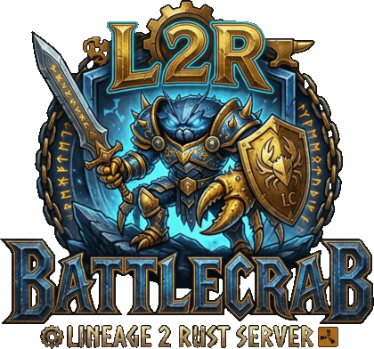

<p align="center">
  
</p>

<h1 align="center">l2r_interlude</h1>

<p align="center">
  A Rust rewrite of the <b>L2J Mobius Interlude Classic</b> Lineage 2 server —
  L2J, but in Rust.
</p>

---

## A port, not a fork

This is a 1:1 port of [L2J Mobius](https://l2jmobius.org) Interlude Classic. The
Java server in the sibling `interlude_classic` tree is the reference
implementation, and it is the ground truth for every behavioural question.

**It is backward compatible with your existing Mobius setup:**

- **The same config files.** Every `.ini` under `dist/game/config` and
  `dist/login/config` is read with Java's `PropertiesParser` semantics, keys and
  defaults included — point this server at a Mobius config directory and it
  behaves as that config says.
- **The same datapack.** The XML, HTML and SQL under `dist/` are consumed
  unchanged. They are treated as the specification: when the port disagrees with
  the data, the port is wrong.
- **The same database schema.** Same tables, same column names (`charId`,
  `accessLevel` — verbatim, not modernised), so an existing database is adopted
  rather than migrated.
- **The same wire protocol.** Unmodified clients connect, and the Rust login
  server has been verified interoperating with the *unmodified Java game
  server*.

Environment variables override any config value. The variable name is derived
from the **config file's path** plus the uppercased key, so
`dist/login/config/LoginServer.ini`'s `URL` is
`DIST_LOGIN_CONFIG_LOGINSERVER_URL` — see
[the table below](#2-know-where-the-database-is-looked-for) for the three that
matter.

## Status

| Component | Status |
|---|---|
| Login server | ✅ Feature-complete, interop-verified against the unmodified Java game server |
| Game server | ✅ All milestones G0–G34 complete — world, combat, skills & effects, quests, clans, sieges, olympiad, grand bosses, instances, pets & summons, fishing, events, mail & community board, and the GM command system |

"Complete" means each milestone's gate was met and verified against the Java
server on the same database and client. Narrow behaviours deliberately skipped
inside shipped features are marked in the code and counted — **none remain** as
of 2026-08-07, and a test fails the build if a new one appears without being
recorded. Start at **[docs/PORTING_STATUS.md](docs/PORTING_STATUS.md)** for the
full picture of what is ported, partial, and deliberately out of scope.

## Documentation

| | |
|---|---|
| **[Porting status](docs/PORTING_STATUS.md)** | What is ported, what is partial, what never will be — one table for the whole port |
| **[Threading model](docs/THREADING_MODEL.md)** | How the server is threaded, why, and what it costs — with diagrams |
| **[Project layout](docs/PROJECT_LAYOUT.md)** | Where code lives, where new code goes, and the conventions |
| **[Logging & audit](docs/LOGGING.md)** | Diagnostics that may drop, audit records that may not, metrics — where each lands and how to read it |
| **[Progress journal](docs/PROGRESS.md)** | The dated record of what landed and what broke on the way |
| [All documentation](docs/README.md) | Index, including the database, parity checklists and the dashboard design |

## Architecture in one paragraph

One dedicated **game thread** owns all mutable world state; tokio handles the
sockets, a dedicated thread owns SQLite, a path worker owns pathfinding, and
everything talks to the game thread over channels — no locks in game logic. Game
objects live in an **ECS** (via the standalone `bevy_ecs` crate): an object is an
entity whose data sits in components packed into contiguous archetype tables, so
the per-tick systems (regen, movement, AI) sweep them as dense linear scans
instead of pointer-chasing a map. The loop runs at a 100 ms tick and warns when
one overruns. Full reasoning, diagrams and trade-offs in
[THREADING_MODEL.md](docs/THREADING_MODEL.md).

## Workspace

- `crates/commons` — shared infrastructure (network core, L2 crypto, config, SQLite), reused by both servers
- `crates/loginserver` — the login server binary
- `crates/gameserver` — the game server binary
- `crates/models` — SeaORM entities for every table, plus the shared repositories
- `crates/migration` — the schema as migrations, and the `l2r-migrate` binary
- `crates/tools` — offline datapack/client tools, and the `l2r-tools` binary
- `crates/dashboard_api` + `web/dashboard` — the web dashboard and its API
- `crates/launcher` — the player-facing updater

## How to run

The whole stack locally: login server, game server, dashboard API, and the web
dashboard. Four processes over **one SQLite file** — that shared file is the
only integration point between them, and there is no sync layer.

```
        L2 client ──▶ loginserver :2106 ──┐
                                          │  registers over :9014
        L2 client ──▶ gameserver  :7777 ──┘
                            │
                            ▼
                  interlude_classic.db  ◀── dashboard_api :8080 ◀── SPA :3000
```

**You need:** a Rust toolchain (edition 2024), and [Bun](https://bun.sh) for the
dashboard SPA. Nothing else — the database is a file, and the datapack is in
this repository.

### 0. Build

```sh
cargo build --release
cd web/dashboard && bun install && cd ../..
```

Use `--release` for anything you intend to play on: a debug game server boots in
about 16 s and ticks far slower under load.

### 1. Create the database

```sh
./target/release/l2r-migrate up -u jdbc:sqlite:interlude_classic.db
```

Running it against an existing database is safe — every statement is
`IF NOT EXISTS`, so it records the migrations as applied and changes nothing.
See [docs/DATABASE.md](docs/DATABASE.md) for fresh installs, adopting a live
database, adding a migration and regenerating entities.

### 2. Know where the database is looked for

> **The one thing that will bite you.** A *relative* SQLite `URL` is resolved
> against the **executable's directory**, not your shell's working directory.
> That is deliberate — in a deployment all binaries sit next to the database, so
> one URL string is correct for every one of them. But running out of a repo
> checkout, `./target/release/gameserver` looks for
> `target/release/interlude_classic.db`, does not find it, and **silently
> creates an empty one** (SQLite creates rather than fails). The symptom is
> "no such table" at runtime, or a login that accepts nobody.

Two ways to avoid it. Either put the database next to the binaries, or — better
while developing — pass an absolute path. Each process derives its override name
from its **config file's path**, so the three prefixes differ:

| Process | Environment variable |
|---|---|
| `loginserver` | `DIST_LOGIN_CONFIG_LOGINSERVER_URL` |
| `gameserver` | `CONFIG_SERVER_URL` |
| `dashboard_api` | `DIST_GAME_CONFIG_DASHBOARD_URL` |

```sh
export DB="jdbc:sqlite:$PWD/interlude_classic.db?journal_mode=WAL&busy_timeout=5000"
```

(The game server's prefix is short because it loads its config *relative to the
datapack root*, so the name stays the same whether you start from the repo root
or from inside `dist/game`. Any key works this way, not just `URL` — the
variable is the prefix plus the uppercased ini key, so `GameserverPort` becomes
`CONFIG_SERVER_GAMESERVERPORT=7778`.)

### 3. Login server — terminal 1

```sh
DIST_LOGIN_CONFIG_LOGINSERVER_URL="$DB" ./target/release/loginserver
```

Run it **from the repository root**: it reads
`dist/login/config/LoginServer.ini` by that exact relative path. It listens on
**2106** for game clients and **9014** for game servers to register on.

### 4. Game server — terminal 2

```sh
CONFIG_SERVER_URL="$DB" \
CONFIG_SERVER_LOGINHOST=127.0.0.1 \
  ./target/release/gameserver
```

It finds the datapack at `dist/game` automatically and listens on **7777**.
`LoginHost` in the shipped `Server.ini` points at a LAN address, so override it
to `127.0.0.1` for an all-local run — otherwise the log fills with
`LoginServer not available, trying to reconnect...`. Keep the datapack
elsewhere with `DATAPACK_ROOT=/srv/l2/dist/game` (neither binary ever changes
its working directory).

### 5. Dashboard API — terminal 3

```sh
DIST_GAME_CONFIG_DASHBOARD_URL="$DB" ./target/release/dashboard_api
```

Listens on **8080** (`dist/game/config/Dashboard.ini`). It refuses to start if
the database is missing its tables, rather than 500ing on every request later.

Two things differ between debug and release builds. A **release** build will not
boot without a session signing key:

```sh
export DASHBOARD_SESSION_SECRET=$(openssl rand -hex 32)
```

A debug build falls back to a fixed non-secret key and warns, so `cargo run`
needs no environment. And a release build bakes the built SPA into the binary,
while a debug build reads it off disk — so in debug you can browse the whole
site on <http://localhost:8080> as long as `web/dashboard/dist` exists
(`bun run build`). Email is optional: with no `DASHBOARD_SMTP_*` variables set,
password-reset and verification links are written to the log instead of sent.

### 6. Web dashboard — terminal 4

```sh
cd web/dashboard && bun run dev
```

Serves the SPA with hot reload on <http://localhost:3000> and proxies `/api/*`
to the API on 8080, so the browser sees a single origin and CORS never applies
locally. If the API is not running you get a 502 whose body says so.

For production the SPA is built (`bun run build`) and served by `dashboard_api`
itself — one origin, one process.

### Ports

| Port | Process | For |
|---:|---|---|
| 2106 | loginserver | game clients |
| 9014 | loginserver | game-server registration |
| 7777 | gameserver | game clients |
| 8080 | dashboard_api | HTTP API (+ the SPA) |
| 3000 | bun dev server | the SPA, with hot reload |

### Connecting a client

Point an Interlude client at the login server and log in. Which address the
login server hands back for the game server comes from
`dist/game/config/ipconfig.xml` — for an all-local setup that wants to be
`127.0.0.1`. For accounts, either register through the dashboard, or set
`AutoCreateAccounts = True` in `dist/login/config/LoginServer.ini` — this dist
ships it **False**, so an unknown login is simply rejected.

## Datapack & client tools

`l2r-tools` answers questions about the datapack by running the *server's* own
geo code over it, so a verdict from it is a verdict in game. It also unpacks and
repacks the client's `system` directory, and reconciles the strings the client
owns (NPC names, system messages) with the server's data.

```sh
cargo build --release -p tools
./target/release/l2r-tools spawn-pockets --region 20_21   # mobs buried under the floor
./target/release/l2r-tools client-dat decrypt             # system -> editable text
./target/release/l2r-tools sync-npc --dry-run             # datapack names -> client
```

All six commands are documented in
**[`crates/tools/README.md`](crates/tools/README.md)**.

## Testing

The suite runs under [cargo-nextest](https://nexte.st) — ~2,970 tests:

```sh
cargo install cargo-nextest --locked   # once
cargo nextest run                        # whole workspace
cargo nextest run -p gameserver          # just the game server
cargo nextest run -p gameserver stealth  # substring filter
cargo nextest run --profile ci           # retries + JUnit (see .config/nextest.toml)
```

nextest runs each test in its own process, which **isolates tests from each
other's global state** — the game-server suite used to hang under plain
`cargo test` because a few integration tests mutate process-global state (the
current directory, a PID-named temp DB). The `.config/nextest.toml` `default`
profile also **terminates any test that runs past ~2 minutes**, so a single
deadlocked test is reported as a `TIMEOUT` failure instead of wedging the run.

Two integration tests copy the real `interlude_classic.db` (an untracked
working-tree file); they run on a full checkout / CI and self-skip on a fresh
checkout or `git worktree` that lacks it. Plain `cargo test` still works for a
single filtered test, but prefer nextest for anything broad.

`e2e_create::full_login_to_character_create` — the full path (login server →
game server: create, relogin, restart, re-select, re-enter, logout, DB
assertions) — runs green in the ordinary suite. It is one of the two tests
above that need the untracked `interlude_classic.db` and self-skip without it;
it carries no `#[ignore]`.

It *was* broken (a 120 s timeout) from its introduction until 2026-08-06, and
**both causes recorded over that time were wrong** — the paragraph that used to
sit here blamed a `PlayFail` login bug that did not exist, and pointed at a
`TODO(login-playauth)` marker that has since been retired. The real cause, from
a per-packet trace, was that the post-restart `CharacterSelect` was silently
swallowed by the **CharacterSelect flood protector** (`FloodProtector.ini`
interval 30 ticks = 3 s; Java's `CharacterSelect.runImpl` returns without any
reply inside the window, and the port mirrors it). The scripted client
re-selected within ~2 s and blocked forever on a `CharSelected` that was never
coming. Server behaviour was retail-faithful throughout; the fix was to wait the
window out before re-selecting. The full account lives above the test.

The lesson generalises past this one test: **a silent no-reply from the server
is what a flood-protector rejection looks like** — check `flood::action_for_opcode`
before suspecting the session machinery.

## Linting & formatting

- **Rust**: `cargo fmt` (rustfmt, default style) and `cargo clippy --workspace --all-targets -- -D warnings`.
  Pre-existing stylistic lints are grandfathered in `[workspace.lints.clippy]` (root `Cargo.toml`) —
  delete an entry there, fix what surfaces, and commit both together to burn the list down.
- **Frontend**: [Biome](https://biomejs.dev) (formatter + linter in one binary) — `cd web/dashboard`
  then `bun run lint` / `bun run format`. Config in `web/dashboard/biome.json`.
- **Tailwind classes**: `eslint-plugin-better-tailwindcss` (`bun run lint:tw`, config in
  `web/dashboard/eslint.config.js`) — conflicting/duplicate/unknown classes and canonical forms
  (`text-(--x)` over `text-[var(--x)]`). ESLint exists in the repo for these rules only.
- **Pre-commit hook** runs both, scoped to what is staged. Activate once per clone:

  ```
  git config core.hooksPath .githooks
  ```

  Bypass in an emergency with `git commit --no-verify`.
