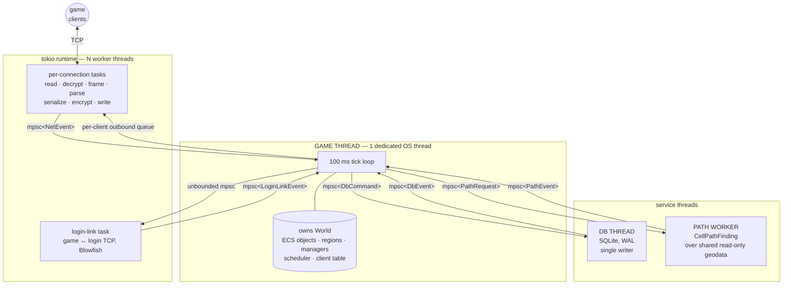

# Threading model

**The rule, in one sentence:** many threads by use case, but exactly one — the
*game thread* — owns and mutates world state; everything else talks to it over
channels.

That single sentence is why there is no `Arc<Mutex<Player>>` anywhere in this
codebase, why game logic reads like straight-line code, and why the port could
translate Java handlers one-for-one without inheriting Java's 275 `synchronized`
blocks.

This document describes the model **as built**. For the concept-level analysis
of the Java implementation it replaces, see
[CONCURRENCY_MODEL.md](CONCURRENCY_MODEL.md); for the object-graph decisions it
rests on, [JAVA_TO_RUST_CHALLENGES.md](JAVA_TO_RUST_CHALLENGES.md).

---

## 1. Topology



On an 8-core machine that is 1 game thread + tokio workers + 1 DB thread +
1 path worker. Every core is usable; exactly one may touch `World`.

**Nothing in that picture shares mutable state.** The only object crossing a
thread boundary by reference is the geodata (`Arc<GeoEngine>`), which is
read-only after boot — the path worker and the game thread both query it, and
neither can write it.

Boot order and the channel wiring are in `crates/gameserver/src/main.rs`; the
loop itself is `game_loop/mod.rs`.

---

## 2. The tick

Base tick is **100 ms** (`game_loop::TICK`), chosen to match Java's
`GameTimeTaskManager` and its high-priority task-manager rate. Slower Java rates
become `world.tick % N == 0` gates, so a "1 s" Java task manager is a system
that runs every 10th tick — same rate, but now at a *defined* phase instead of
whenever its pool thread happened to fire.

```
   ┌─ tick start ────────────────────────────────────────────────────────┐
   │                                                                     │
   │  1. drain network      connects, disconnects, inbound packets       │
   │  2. drain services     login-link → DB → path worker                │
   │  3. fire due timers    one-shot scheduler (Java ThreadPool.schedule) │
   │  4. tick systems       in fixed order, see table below              │
   │  5. flush              outbound packets, DB commands                │
   │                                                                     │
   │  overrun > 50 ms → warn with the tick number                        │
   └─ sleep the remainder of the 100 ms ─────────────────────────────────┘
```

| System | Every | Wall clock |
|---|---:|---|
| movement + region-switch visibility | 1 tick | 100 ms |
| player combat (chase + swing) | 1 tick | 100 ms |
| drowning | 1 tick | 100 ms |
| auto-play / auto-use | 3 ticks | 300 ms |
| NPC AI think, combat stance, PvP flag decay | 10 ticks | 1 s |
| effect & damage zones | 10 ticks | 1 s |
| walker routes | 10 ticks | 1 s |
| auto-potions | 10 ticks | 1 s |
| autosave check, teleport watchdog | 10 ticks | 1 s |
| HP/MP/CP regen, weight sweep | 30 ticks | 3 s |

**A rate is not the whole story.** Java's 1 s `AttackableThinkTaskManager` does
not mean a monster waits a second to react — `onEvtThink()` is *also* called
directly off the fast paths (`onEvtArrived` and friends, at 100 ms). Porting the
fixed-rate sweep and dropping those event edges is precisely what makes a ported
mob feel sluggish: it closes on its target, then stands there for up to a second
before swinging. When a system here is the port of a slow Java task manager,
check `CtrlEvent`/`notifyEvent` for the edges that re-enter it early.

**One-shot timers** are a binary heap keyed by tick. Every Java
`ThreadPool.schedule(() -> ...)` site — skill cast completion, teleport finish,
buff expiry, door open/close, siege phases — becomes an entry capturing **object
ids, never references**. If the target is gone when the timer fires, the task is
a no-op, which is the same net effect Java gets from its `isDead()`/null checks
inside the runnable.

---

## 3. Why this design

### What it replaces

Java runs game logic concurrently on four pools at once. The wiring that decides
this is a single argument in `GameServer.java`:

```java
new ConnectionBuilder<>(addr, GameClient::new, new GamePacketHandler(), ThreadPool::execute)
```

The packet executor is `ThreadPool::execute`, so `packet.run()` — attack, trade,
enchant — executes on a shared pool, concurrently across clients *and
concurrently for the same client*. Correctness rests entirely on 275
`synchronized` sites, `ConcurrentHashMap`s and `volatile`s. What that model does
**not** give you, and which are defects rather than features to preserve:

- **No per-client packet ordering under load.** Two packets from one client can
  execute out of order.
- **No inbound backpressure.** The instant pool's queue is unbounded. *(Not yet
  improved on — see rule 3.)*
- **Races by design.** Creature sets are iterated while being mutated; stats are
  read without locks. Tolerated because the JVM keeps them memory-safe.

### Why single-owner instead of fine-grained locking

Rust will not let you have Java's benign races. The two honest options were a
lock-per-object graph (`Arc<Mutex<…>>`, or an actor per creature) and a single
owner. Single owner won on three counts:

1. **The port stays a port.** A Java handler that touches attacker, target,
   party, and the region's known list in one method becomes one Rust function
   that does the same. With per-object locks it becomes a lock-ordering problem
   — and Java's nested `synchronized` (`doDie` → listeners → back into the
   creature) would have become deadlocks needing per-site redesign.
2. **Deadlock and data races stop being possible**, rather than being made
   unlikely. There is no lock to take in the wrong order.
3. **The workload fits.** This is a ~100 ms-granularity game with tens of
   thousands of mostly idle NPCs, not a physics engine. One core is enough for
   logic; the expensive work — crypto, serialization, pathfinding, SQLite — is
   already off the game thread.

### What "off the game thread" buys

Per-connection tasks do the CPU-heavy byte work (decrypt, parse, serialize,
encrypt) in parallel. The game thread produces cheap packet *values*. Java
serializes on whichever thread sends and encrypts inside the client lock; moving
that out is a deliberate change, not an accident of the port.

---

## 4. Rules

These are enforced by structure and checked in review.

1. **Nothing on the game thread may block.** No file, DB or socket syscalls, no
   pathfinding, no `Mutex::lock` on anything shared. The type system helps:
   handlers receive `&mut World` and channel senders, so blocking APIs are
   simply not in scope.
2. **Timers and queued tasks capture ids, not objects.** A dead id is a no-op.
3. **Channels are unbounded, and that is a known debt, not a decision.** Both
   directions use unbounded queues today (`NetEventTx` inbound,
   `OutboundTx` per connection), so a packet flooder can grow a queue exactly as
   it can against Java. The design called for bounded inbound plus Java's
   `DropPackets`/`DropPacketThreshold` policy on the outbound side; neither is
   built. If you are adding backpressure, this is the rule to change first.
4. **Tick budget is a metric, not a hope.** A tick over 50 ms warns with its
   number. Tick overrun is *the* failure mode of this architecture, so it has to
   be visible from day one.
5. **A panic must not outlive its packet, and a dead game thread must not
   outlive its process.** Each inbound packet is handled inside `catch_unwind`
   (Java parity: `ExecuteThread` catches `Throwable` per packet); the offending
   client is disconnected, because its handler may have died mid-mutation and
   that session's state is suspect, and the world lives on for everyone else.
   If a panic escapes anyway — a tick system, a timer — `main` notices the game
   thread exiting without a shutdown request and exits nonzero, so systemd's
   `Restart=on-failure` brings the server back rather than leaving a live
   listener in front of a dead game loop.

   > This is why `panic = "abort"` is **not** set in the release profile. It
   > would turn a single bad packet into a process kill.

---

## 5. Trade-offs

Honest ledger. The wins are structural; the costs are real and two of them are
felt daily.

### What this buys

| | |
|---|---|
| **No locks in game logic** | No deadlocks, no lock ordering, no `Arc<Mutex<>>` noise. Handlers read like the Java they came from. |
| **Deterministic ordering** | Systems run in the same order every tick. A whole class of Java races cannot occur, and reproducing a bug does not depend on thread interleaving. |
| **Per-client packet ordering guaranteed** | Strictly more correct than Java, which loses ordering under load. |
| **Tests are simple and fast** | A test builds a `World`, calls the system, asserts. No async runtime, no synchronization, no flakiness — which is how the suite reaches ~2,970 tests. |
| **Parallelism where it pays** | Crypto, serialization, pathfinding and SQLite all run off the game thread, on all cores. |

### What it costs

| | |
|---|---|
| **One core for logic** | The ceiling is a single thread's throughput. Mitigated by the tick-overrun metric, and by the fact that the heavy work is already elsewhere — but it is a real ceiling, and the scaling path in §6 is not built. |
| **Up to one tick of added latency** | A packet arriving just after the drain waits ≤100 ms. Java handled it immediately, pool permitting. Acceptable because 100 ms is already the game's action granularity and the client interpolates — and fixable without redesign by waking the drain on the channel instead of sleeping. |
| **Mid-handler DB reads had to be restructured** | Java calls JDBC inline in a handler; here that would block the world. Those sites split into request → continue-next-tick. This is **the one place** the port had to restructure logic rather than translate it, and it is a genuine porting hazard: the Java code reads as if the value is available now. |
| **A slow system stalls everything** | There is no preemption. One pathological loop delays every player, not just the one who triggered it. |
| **No backpressure yet** | Queues in both directions are unbounded (rule 3). A flooding client can grow memory, and the outbound drop policy Java has is not ported. |
| **`bevy_ecs` parallelism deliberately unused** | The ECS could schedule systems in parallel; doing so would break the single-owner rule, so it is off. We pay for a feature we do not use. |

---

## 6. Scaling path (not built)

If one core for logic ever proves insufficient: shard `World` by region or
instance into N tick loops that exchange messages, since towns, hunting zones
and instances partition naturally. The single-owner invariant is unchanged
inside each shard, so this is an evolution rather than a rewrite.

**Do not build it until a profiler asks.** The tick-overrun warning is the
trigger to watch.

---

## 7. Object storage: ECS

`World`'s object registries are an **ECS** (Entity–Component–System) built on the
standalone [`bevy_ecs`](https://crates.io/crates/bevy_ecs) crate — no other part
of Bevy is used.

Instead of each game object being one large struct in a map, an object is an
*entity* (an id) whose data lives in *components*. Components of the same shape
are stored together in contiguous archetype tables, so per-tick sweeps become
dense linear scans instead of pointer-chasing a `HashMap`. It also replaces
Java's `WorldObject → Creature → Playable → Player` inheritance with
composition: new behaviour attaches a component rather than growing a hierarchy.

What matters for *this* document: **the ECS changes nothing about the threading
model.** The `bevy_ecs::World` lives inside our `World` alongside its sibling
services, owned and mutated by the game thread alone; systems remain plain
functions called in the §2 order. Presence-based components (`Movement`,
`Casting`, `Intent`) exist only while that state is active, so a sweep visits
exactly the movers and casters rather than 34.9k idle NPCs.

Details of the component split are in
[CONCURRENCY_MODEL.md](CONCURRENCY_MODEL.md) §2.8 and
`crates/gameserver/src/store.rs`.
